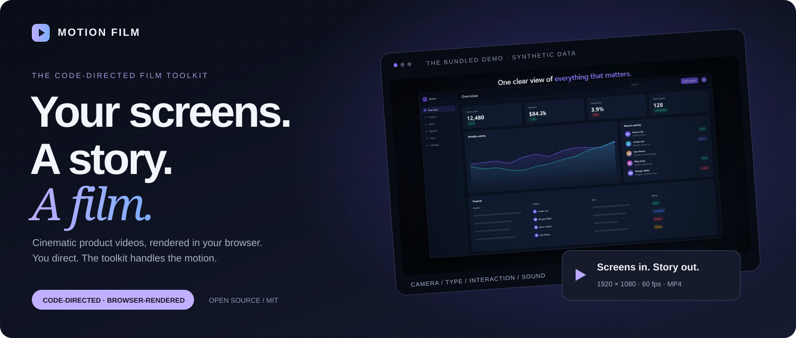
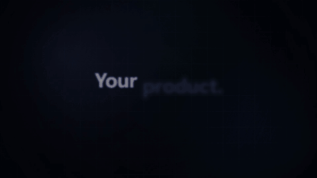
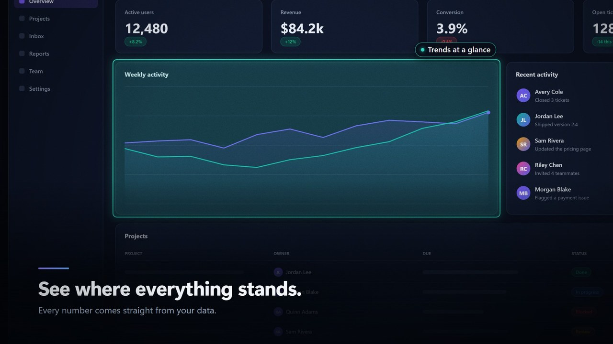
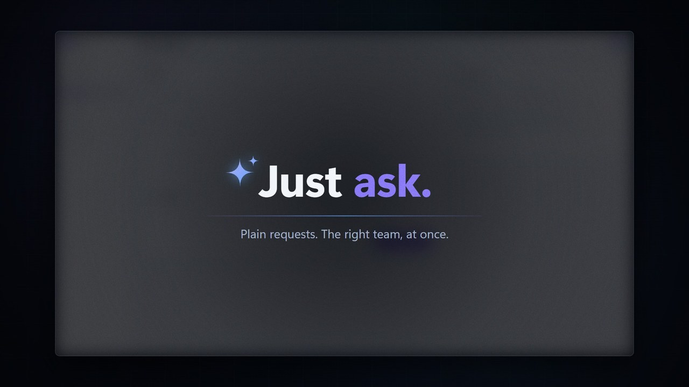
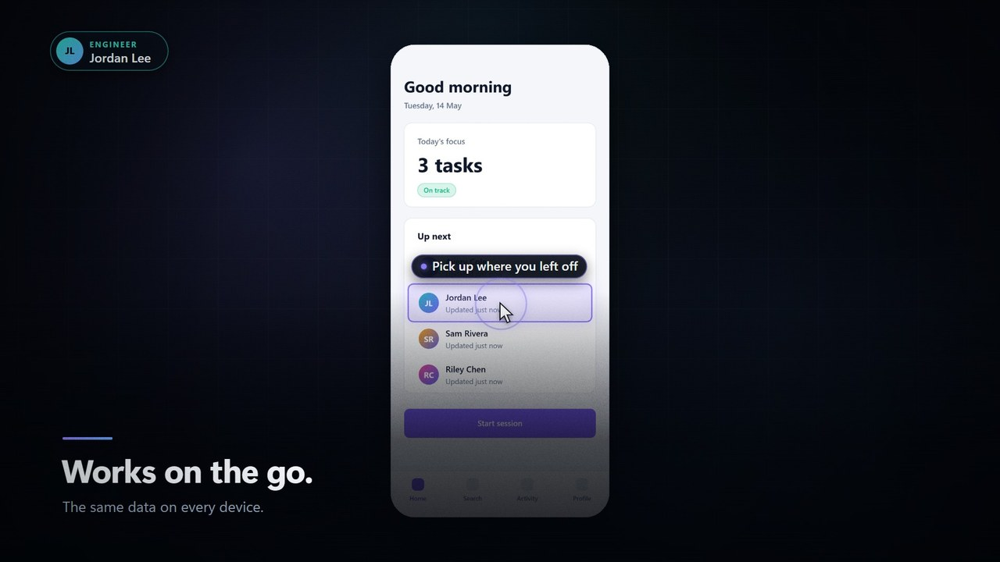
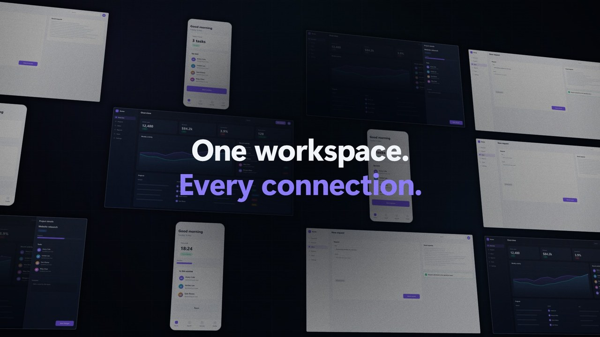
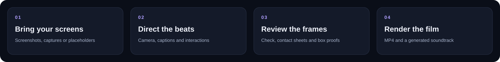

<p align="center">
  
</p>

<h1 align="center">Motion Film</h1>

<p align="center">
  <strong>Turn software screens into cinematic product films.</strong><br>
  You bring the product, the story and the words. The toolkit brings the motion.
</p>

<p align="center">
  
</p>

<p align="center">
  <a href="#see-the-motion">See the motion</a> &nbsp;·&nbsp;
  <a href="#quickstart">Quickstart</a> &nbsp;·&nbsp;
  <a href="#direct-it-with-an-ai-agent">AI workflow</a> &nbsp;·&nbsp;
  <a href="#the-toolkit">The toolkit</a> &nbsp;·&nbsp;
  <a href="#documentation">Documentation</a>
</p>

---

## See the motion

<p align="center">
  <picture>
    <source media="(prefers-reduced-motion: reduce)" srcset="docs/media/poster.jpg">
    
  </picture>
</p>

<p align="center"><sub>A shortened, silent loop from the included demo. The full film runs 58.6 seconds and has a generated soundtrack.<br>All demo screens, brands, people and figures are illustrative—not customer data or product claims.</sub></p>

<table>
  <tr>
    <td width="50%">
      
      <strong>Guide the eye.</strong><br>
      Camera moves, spotlights and callouts make one thing matter at a time.
    </td>
    <td width="50%">
      
      <strong>Make the words land.</strong><br>
      Kinetic titles, chapter breaks and captions give the story a rhythm.
    </td>
  </tr>
  <tr>
    <td>
      
      <strong>Show the interaction.</strong><br>
      Choreograph typing, clicks, taps and drawers across screen states.
    </td>
    <td>
      
      <strong>Finish with perspective.</strong><br>
      Screen grids and floating 3D walls turn individual moments into a whole.
    </td>
  </tr>
</table>

## Screens in. Story out.

A folder of screenshots is not a product film. Motion Film gives those screens a camera, a pace
and a soundtrack—with a storyboard you can read, change and reuse.

**For developers, product teams and makers** creating launch films, demos and feature walkthroughs.
Use screens from a web app, a desktop tool, a phone app or design mock-ups. The film is code;
the output is a video.

- **App-independent.** Name the regions of your own screens; no particular layout is required.
- **Local core workflow.** No account, API key or cloud rendering service is needed.
- **Code, not a black box.** Direct scene recipes or draw your own with the low-level kit.
- **An agent can take the director's chair.** A brief, a skill and review tools make the workflow explicit.

No video editor, ffmpeg, Node.js or npm is needed for the **core preview and rendering workflow**.
Automatic web capture is optional and uses Playwright, which includes a Node.js driver.

## Quickstart

**You need Python 3.9+ and a current Chrome or Edge.** Download or copy the folder, open a terminal
at its root, and start the local preview:

```bash
python server.py
```

> **Windows:** if `python` opens the Microsoft Store, use `py` instead.
> **macOS / Linux:** your command may be `python3`.

Open **http://127.0.0.1:8020/?story=examples/demo.js** in Chrome or Edge and press **Play**.
The demo is self-contained: its screens are drawn placeholders, so you need no screenshots to try it.

To check, review and export that same demo:

```bash
python tools/run.py check --story examples/demo.js
python tools/run.py sheet --story examples/demo.js --transitions
python tools/run.py render --story examples/demo.js --name demo
```

The runner opens a browser window and writes its report, review images, MP4 and soundtrack WAV
to the local output directory. **Keep the render window visible.** Export draws every frame offline;
it is not real-time and can take many minutes.

For your own film, start with [film/storyboard.js](film/storyboard.js).
For a fuller film showing the built-in recipes, read [film/examples/demo.js](film/examples/demo.js).

## From a screen to a scene



| You supply | The toolkit supplies |
|---|---|
| Screenshots or screen states | Framing, camera movement and 3D cards |
| Meaningful regions: a field, a chart, a button | Outlines, spotlights and callouts |
| A brief, truthful captions and a beat sheet | Timing, transitions and motion blur |
| Your brand, logo and fonts | Titles, logo moments and end cards |
| A final visual review | Frame-by-frame MP4 export and generated sound |

### Direct it with an AI agent

Open the folder in your coding agent and give it a brief:

> Make a 45-second product film for our app at http://localhost:3000, aimed at new users.
> Use demo data and our own screenshots. Show the overview, a key interaction and the result.
> Follow AGENTS.md and the product-film skill. Check the storyboard, review the contact sheets,
> then render and verify the MP4. Ask before opening browser windows or showing private data.

[AGENTS.md](AGENTS.md) describes the tools and rules. [CLAUDE.md](CLAUDE.md) points Claude Code
to the same guide. The [product-film skill](.claude/skills/product-film/SKILL.md) walks an agent
through briefing, screens, directing, review and export. If the agent does not discover it
automatically, ask it to read those files explicitly.

**The agent still needs your facts.** It must not invent product capabilities, metrics, testimonials
or customer names. It should ask when the brief leaves something uncertain.

### Or direct it yourself

1. **Bring a screen.** Import a screenshot, optionally capture your web app, or start with placeholders.
2. **Name the regions.** Use the box editor to mark the parts your film will point at.
3. **Write the beats.** Set the words, framing and timing in the storyboard.
4. **Check, look, refine.** Review contact sheets and box proofs before rendering.

This small storyboard works on a generated placeholder—no image files required:

```js
import { makeFilm, beats as B, placeholder } from './lib/kit.js';

const home = placeholder({
  name: 'home',
  blocks: [
    { kind: 'stat', key: 'metric', box: [280, 180, 600, 220],
      title: 'Example metric', value: '1,234' },
  ],
});

export default makeFilm({
  brand: { name: 'Your product', tagline: 'Your real tagline', url: 'example.com' },
  theme: { accent: '#8B7CF6' },
  screens: [home],
  beats: [
    B.title({ lines: ['Your product.', 'Told in motion.'] }),
    B.rise({ screen: 'home', headline: 'Start with the big picture.' }),
    B.tour({
      screen: 'home',
      caption: ['Show what matters.', 'One idea per beat.'],
      steps: [{ box: 'metric', say: 'Focus on the detail' }],
    }),
    B.end(),
  ],
});
```

Replace the placeholder with your own capture using the same screen and region names.
Learn how in the [screens guide](docs/screens.md).

## The toolkit

<details>
<summary><strong>12 scene recipes · one readable storyboard</strong></summary>

| Beat | What it brings |
|---|---|
| `title` | Kinetic titles, optionally over a screen that sharpens into view |
| `logo` | A logo lockup, bloom of light and musical impact |
| `rise` | A screen rising out of perspective beneath a headline |
| `tour` | Guided camera stops with highlights, arrows, reveals and changing values |
| `type` | Typing into a field, clicking send and moving to the next state |
| `click` | A pointer moving and clicking through a flow |
| `drawer` | A sliding panel and a guided look at its fields |
| `statement` | Short lines landing one after another |
| `grid` | Screens arranged as labelled tiles |
| `wall` | A floating, perspective wall of screens |
| `end` | A branded end card with tagline and URL |
| `custom` | Your own scene, drawn with the low-level kit |

</details>

<details>
<summary><strong>14 transitions · picture-led sound</strong></summary>

`cut` · `fade` · `dip` · `blur` · `zoom` · `zoom-out` · `flash` · `wipe` ·
`whip-left` · `whip-right` · `whip-up` · `whip-down` · `slide-up` · `slide-down`

Motion blur is applied to moving transitions. Generated music follows the beats' energy;
clicks, typing, impacts, risers and whooshes are placed with the picture.

</details>

## What is verified—and what is not

| Area | Status |
|---|---|
| Windows / Edge core workflow | Demo and starter checked; contact sheets reviewed |
| Full demo export | 3,515 frames, 1920×1080 at 60 fps; H.264 video and stereo AAC audio verified |
| Screenshot import and box editor | Import, nested regions, selection, movement, resizing and saving exercised |
| Automatic web capture | Optional Playwright path; not verified in the current environment |
| macOS, Linux and headless rendering | Not verified here; browser and encoder support varies |

Verification above was performed on **2026-10-05**, not by a hosted CI pipeline.
The toolkit is **not a drag-and-drop timeline editor**: you or your agent edits the storyboard.
On systems without an AAC encoder, the MP4 is silent and a soundtrack WAV is saved alongside it.

## Documentation

| Start here | Go deeper |
|---|---|
| [Screens and the box editor](docs/screens.md) | [Every beat and option](docs/beats.md) |
| [Directing, pace and storytelling](docs/directing.md) | [Low-level techniques](docs/techniques.md) |
| [Rendering and troubleshooting](docs/rendering.md) | [Brief template](docs/brief-template.md) |
| [Contributing](CONTRIBUTING.md) | [Security and data safety](SECURITY.md) |
| [Standalone project landing page](docs/index.html) | [Public graphics and presentation guide](docs/showcase.md) |

<details>
<summary><strong>Repository map</strong></summary>

```text
film/storyboard.js       your film
film/examples/          the self-contained demo and placeholder screens
film/lib/               camera, scenes, effects, sound and MP4 export
film/boxes.html         screenshot region editor
film/shots/             local screenshots and manifests (ignored)
film/out/               local renders, sheets and reports (ignored)
docs/                   technical guides and the static project page
docs/media/             public demo visuals for the README and landing page
tools/                  capture, import, review, export and inspection helpers
AGENTS.md               coding-agent guide
CLAUDE.md               Claude Code entry point
```

</details>

## Local by design. Public on purpose.

The film server binds to **127.0.0.1**, not a public interface. Raw captures, render outputs,
private capture plans and session-state files are excluded by the ignore rules. Environment
files and common private-key files are excluded too. **Ignore rules are not a secret scanner:**
review everything before sharing, especially screenshots and imported brand assets.

Only synthetic demo media is included in the public gallery. Core rendering needs no third-party
Python packages; optional capture and showcase dependencies are listed separately.

---

<p align="center">
  <strong>Your product. Your story. Your film.</strong><br>
  <sub>Open source under the <a href="LICENSE">MIT licence</a>. Screenshots, fonts and logos you import need their own permissions.</sub>
</p>
